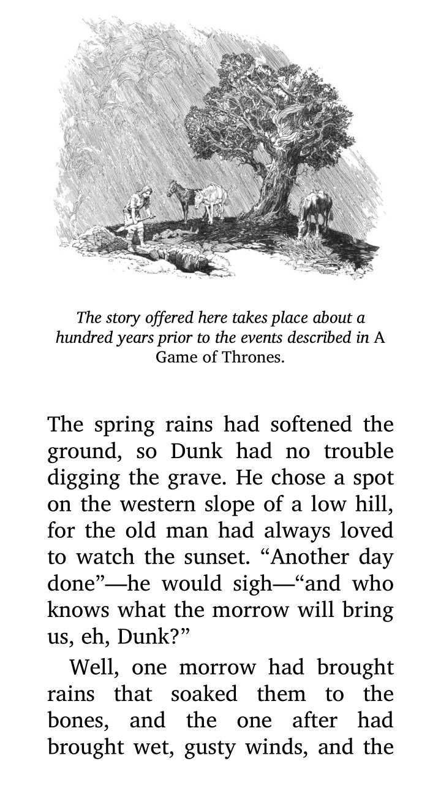

## Description

EPUB reader for the **Nintendo Switch**.

---

## Screenshots

  
  

---

## Key Features

* **Portrait Orientation:** Purpose-built for vertical play, offering a natural and comfortable reading posture.
* **Global Settings:** Synchronized font size across all books in your library.
* **Progress Saving:** Automatically remembers the last page read for every individual book.

---

## Controls (Handheld Portrait)

Since the console is held vertically, the controls are mapped for maximum ergonomic comfort:

| Button | Action |
| :--- | :--- |
| **A** | Toggle Page Number / Next Page |
| **D-Pad Right** | Next Page |
| **D-Pad Left** | Previous Page |
| **X** | Increase Font Size |
| **Y** | Decrease Font Size |
| **B** | Return to Library (Auto-saves progress) |
| **Plus (+)** | Quick Exit Application |
| **Touchscreen** | Swipe Left/Right to turn pages |
